## Lab1

**Що було зроблено:**

- Створено звичайні сторінки(page), шаблони(layout), сторінки завантаження(loading)
  

- У layout.tsx додала компонент NavLinks(навігаційне меню)

  

- За допомогою fetch-запитів отримувала та виводила інформацію про articles

  

- Для відображення favorite articles створила окремий компонент FavoriteArticle. Також реалізувала skeleton, щоб кожен заголовок підвантажувався окремо.
  

- Перетворила сторінку /articles/[id] на статично згенеровану за допомогою generateStaticParams, що дозволило попередньо створювати сторінки під час білду та покращити швидкість завантаження.

- Для запуску застосунку в production-режимі виконала npm run build, що створює оптимізовану збірку проєкту (мініфікація, генерація статичних сторінок, оптимізація ресурсів).
  

  Після успішної збірки запустила застосунок за допомогою npm run start, що піднімає production-сервер.
  

- Для статичного запуску застосунку додала в next.config.ts параметр output: 'export', що дозволяє згенерувати повністю статичну версію сайту. Після білду створюється папка out з HTML-файлами, які можна розмістити на будь-якому static-хостингу без використання Node.js сервера.
Усі динамічні маршрути були попередньо згенеровані через generateStaticParams. Потім запустила застосунок через npx http-server out

  

- Створено глобальні стилі змінних та типографії(styles/layout.css, typography.css, variables.css), модульний css файл для меню(nav-link.module.css), кастомізувала конфігурацію TailwindCSS, створила свої
  брейкпоїнти для розширень екранів (tailwind.config.ts)
- Підключила бібліотеку MUI та використала компонент Alert

**Роздуми:**

Найбільше часу я витратила на розуміння різниці між статичним і динамічним запуском застосунку.

Динамічний запуск передбачає роботу через сервер (Node.js), де сторінки можуть генеруватися під час запиту користувача. Це забезпечує більшу гнучкість і можливість роботи з динамічними даними, однак потребує наявності серверної частини.

Статичний запуск генерує готові HTML-файли під час білду, що дозволяє розміщувати сайт на будь-якому static-хостингу без використання сервера. Такий підхід забезпечує кращу продуктивність і простіший деплой, однак потребує попередньої генерації всіх динамічних маршрутів.

У результаті виконання лабораторної роботи було закріплено розуміння принципів статичної та динамічної генерації сторінок, а також особливостей їх застосування в сучасних веб-застосунках.

## Lab 2

У ході виконання лабораторної роботи було досліджено механізм захисту даних за допомогою файлу .env та префікса NEXT_PUBLIC_.

Ключові результати експерименту:
* Публічні змінні (NEXT_PUBLIC_):

  * Змінна NEXT_PUBLIC_SITE_NAME доступна як на сервері, так і в браузері користувача.

  * Це дозволяє безпечно виводити назву сайту або публічні ключі в клієнтських компонентах ("use client").

* Приватні змінні (Серверні):

  * Змінна SERVER_SECRET доступна виключно на стороні сервера (у консолі терміналу).

  * При спробі вивести її в браузері (консоль розробника), Next.js повертає undefined.

  * Це критично важливо для захисту таких даних, як DATABASE_URL (Neon), щоб запобігти витоку паролів до бази даних у клієнтський код.

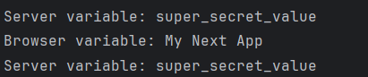

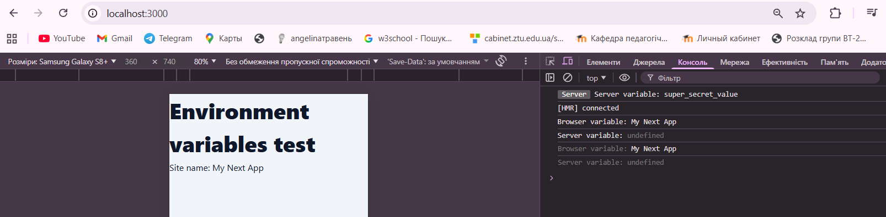

****
## Створення та налаштування Prod бази даних
Для розгортання основної (Production) бази даних було обрано хмарне рішення Vercel Postgres (або сумісний PostgreSQL інтерфейс). Як основний інструмент для взаємодії з базою даних використано Prisma ORM. Це дозволяє працювати з даними через типізовані об'єкти, уникаючи написання сирого SQL там, де це доцільно.

Було реалізовано механізм автоматичного заповнення бази даних за допомогою seed файлу. Це дозволяє швидко розгорнути структуру таблиць та наповнити їх початковими даними для тестування функціоналу.

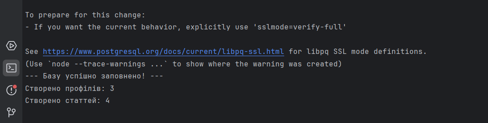

## Створення Dev бази даних та керування конфігурацією

В якості бази даних для розробки (Development) було обрано сервіс Neon.tech. Це дозволяє ізолювати експериментальні дані від основної бази. Підключення до Neon налаштовано з використанням пулінгу з'єднань (pooler), що є оптимальним для Serverless середовищ

Головною особливістю реалізації є використання файлів .env та .env.local для автоматичного перемикання між базами:

* У файлі .env зберігаються глобальні налаштування та посилання на Prod базу.

* У файлі .env.local (який не потрапляє в репозиторій) прописано DATABASE_URL для Dev бази у Neon.

Принцип роботи:

Next.js та Prisma автоматично пріоритезують значення з .env.local під час локальної розробки. Таким чином, запускаючи npx prisma db seed локально, ми заповнюємо Dev базу (скріншот dev.png), а при деплої — Prod базу.
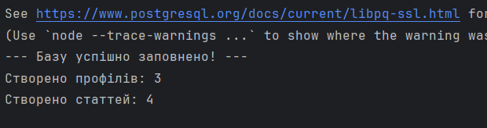

*****

## API
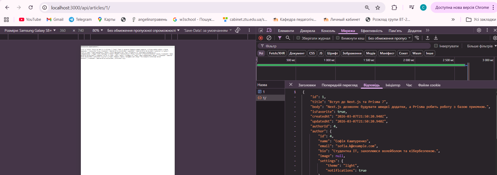

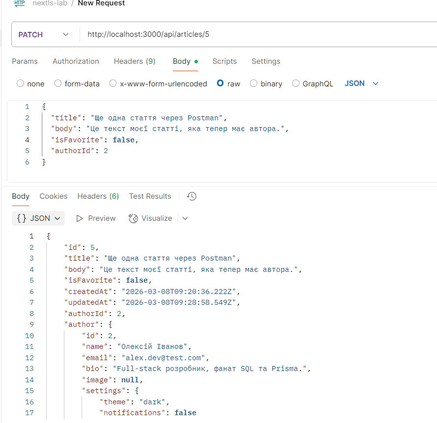
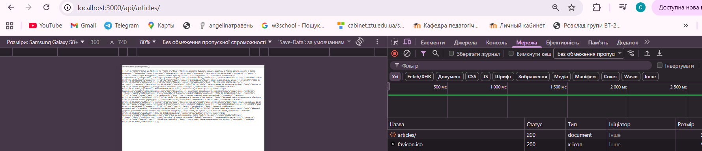
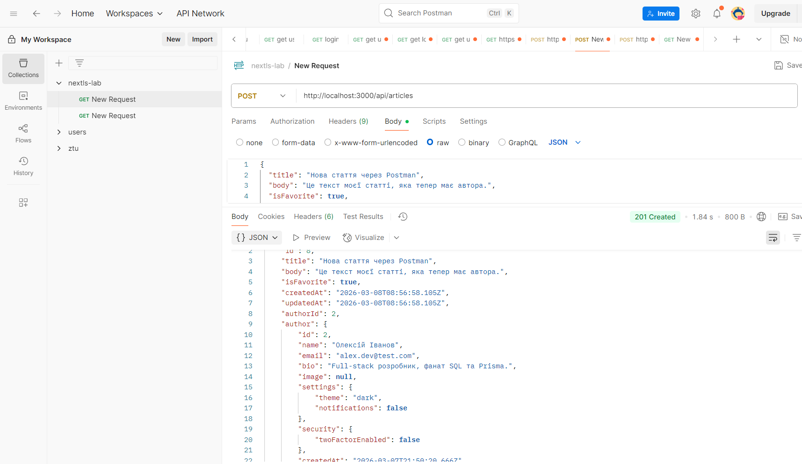

## Клієнтські сторінки
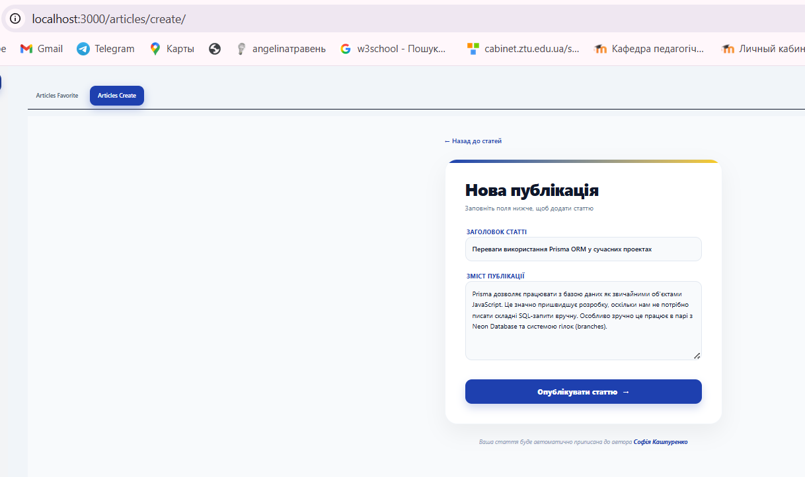
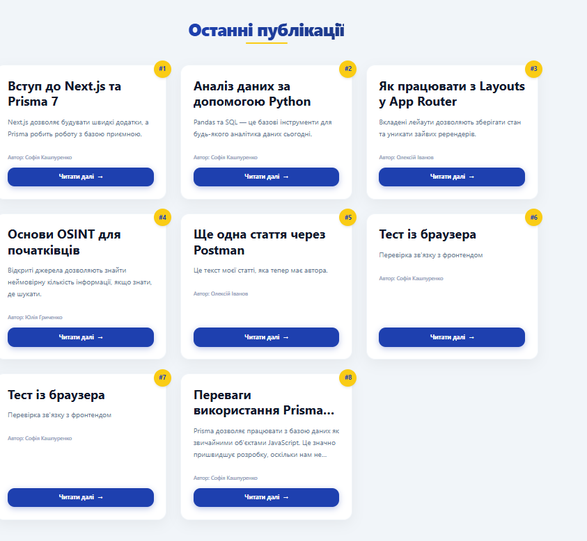
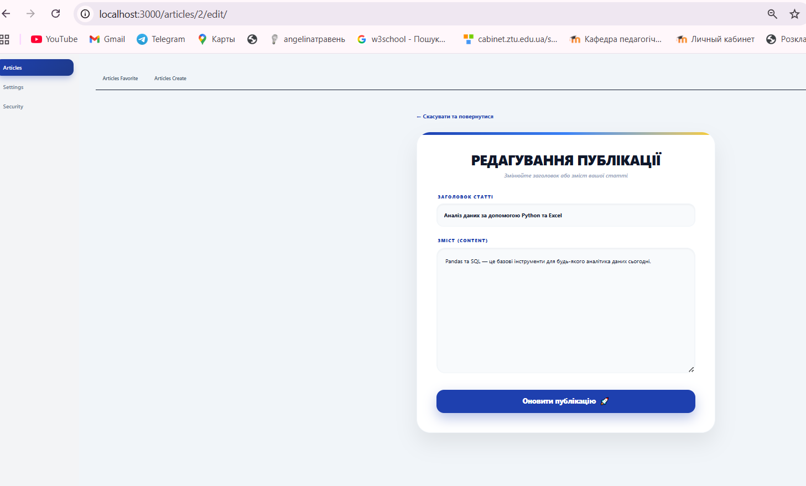
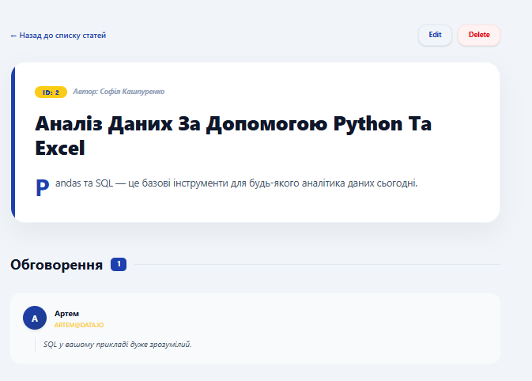
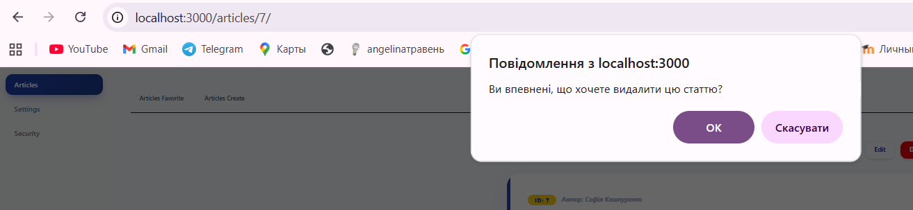
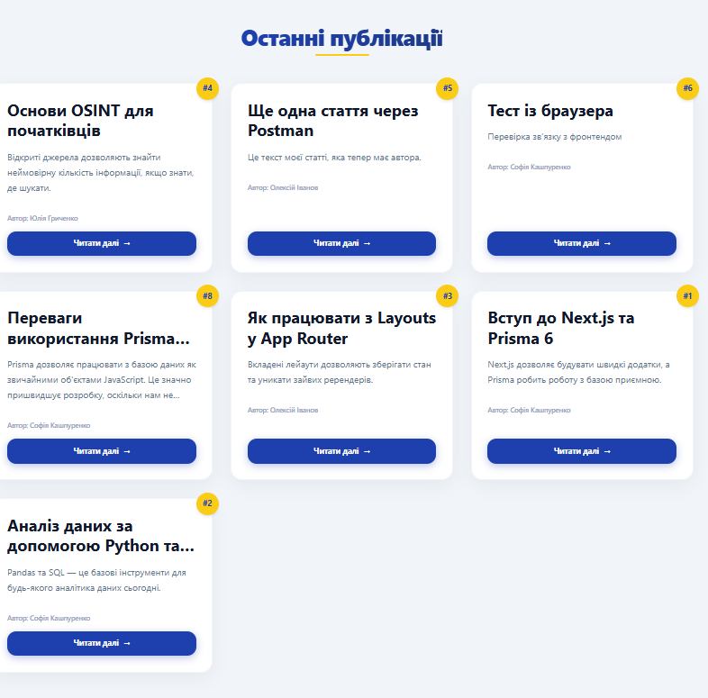
