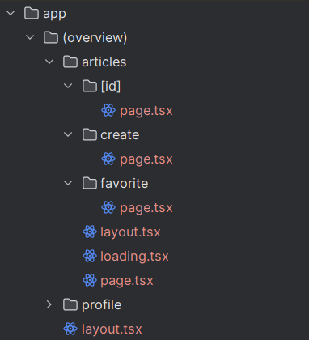
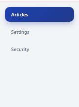
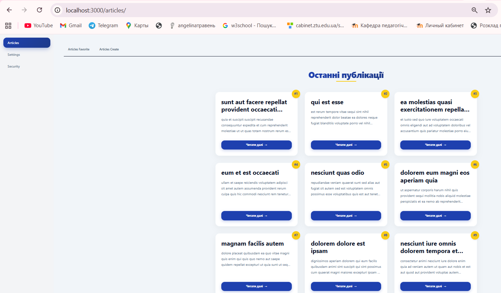
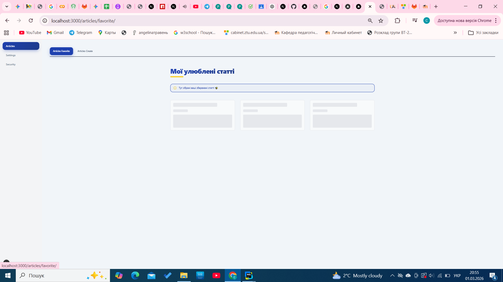
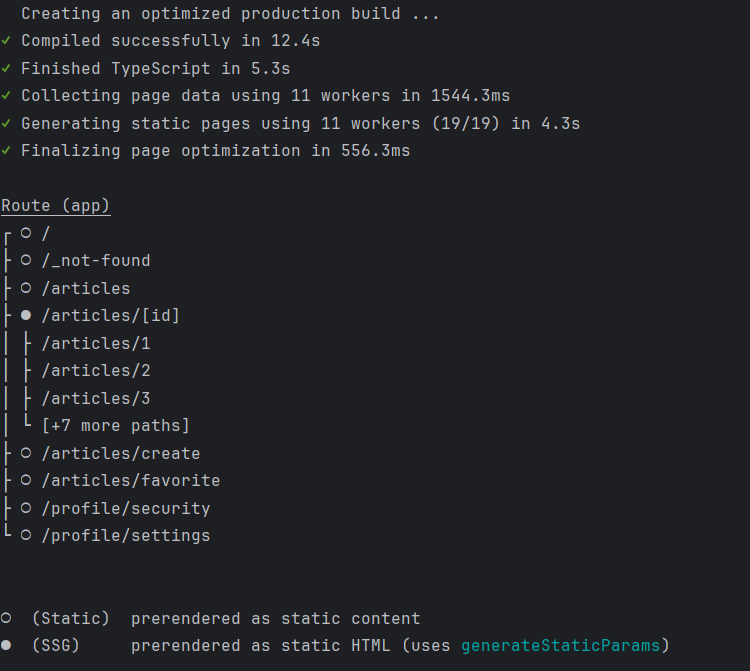
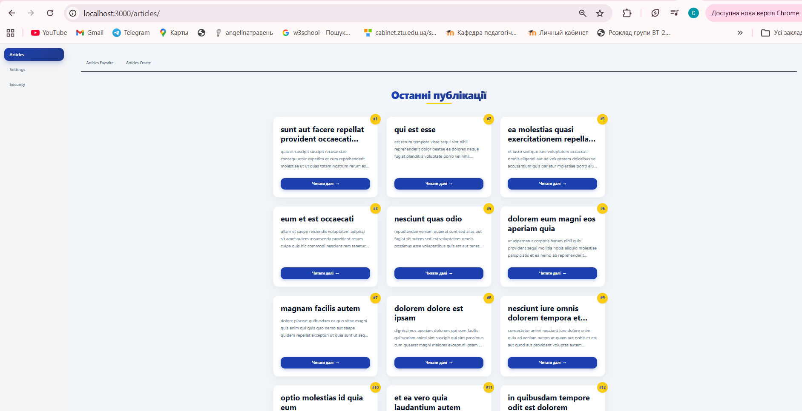
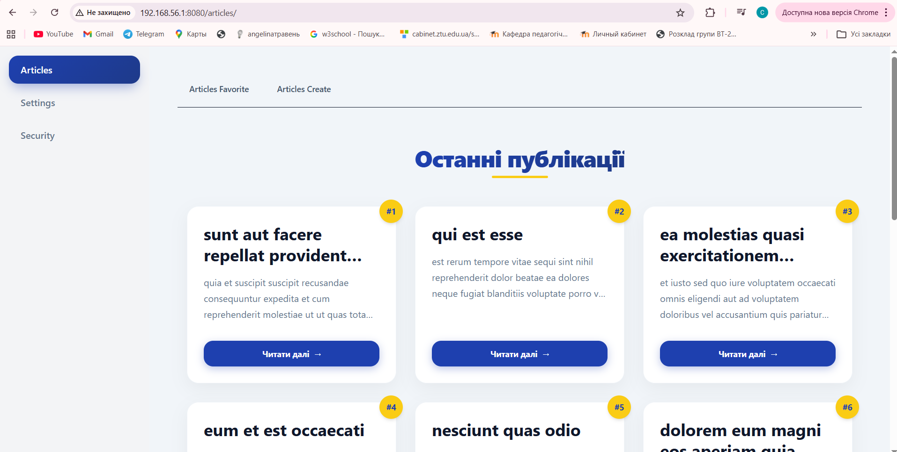

## Lab1

**Що було зроблено:**

- Створено звичайні сторінки(page), шаблони(layout), сторінки завантаження(loading)
  

- У layout.tsx додала компонент NavLinks(навігаційне меню)

  

- За допомогою fetch-запитів отримувала та виводила інформацію про articles

  

- Для відображення favorite articles створила окремий компонент FavoriteArticle. Також реалізувала skeleton, щоб кожен заголовок підвантажувався окремо.
  

- Перетворила сторінку /articles/[id] на статично згенеровану за допомогою generateStaticParams, що дозволило попередньо створювати сторінки під час білду та покращити швидкість завантаження.

- Для запуску застосунку в production-режимі виконала npm run build, що створює оптимізовану збірку проєкту (мініфікація, генерація статичних сторінок, оптимізація ресурсів).
  

  Після успішної збірки запустила застосунок за допомогою npm run start, що піднімає production-сервер.
  

- Для статичного запуску застосунку додала в next.config.ts параметр output: 'export', що дозволяє згенерувати повністю статичну версію сайту. Після білду створюється папка out з HTML-файлами, які можна розмістити на будь-якому static-хостингу без використання Node.js сервера.
Усі динамічні маршрути були попередньо згенеровані через generateStaticParams. Потім запустила застосунок через npx http-server out

  

- Створено глобальні стилі змінних та типографії(styles/layout.css, typography.css, variables.css), модульний css файл для меню(nav-link.module.css), кастомізувала конфігурацію TailwindCSS, створила свої
  брейкпоїнти для розширень екранів (tailwind.config.ts)
- Підключила бібліотеку MUI та використала компонент Alert

**Роздуми:**

Найбільше часу я витратила на розуміння різниці між статичним і динамічним запуском застосунку.

Динамічний запуск передбачає роботу через сервер (Node.js), де сторінки можуть генеруватися під час запиту користувача. Це забезпечує більшу гнучкість і можливість роботи з динамічними даними, однак потребує наявності серверної частини.

Статичний запуск генерує готові HTML-файли під час білду, що дозволяє розміщувати сайт на будь-якому static-хостингу без використання сервера. Такий підхід забезпечує кращу продуктивність і простіший деплой, однак потребує попередньої генерації всіх динамічних маршрутів.

У результаті виконання лабораторної роботи було закріплено розуміння принципів статичної та динамічної генерації сторінок, а також особливостей їх застосування в сучасних веб-застосунках.
